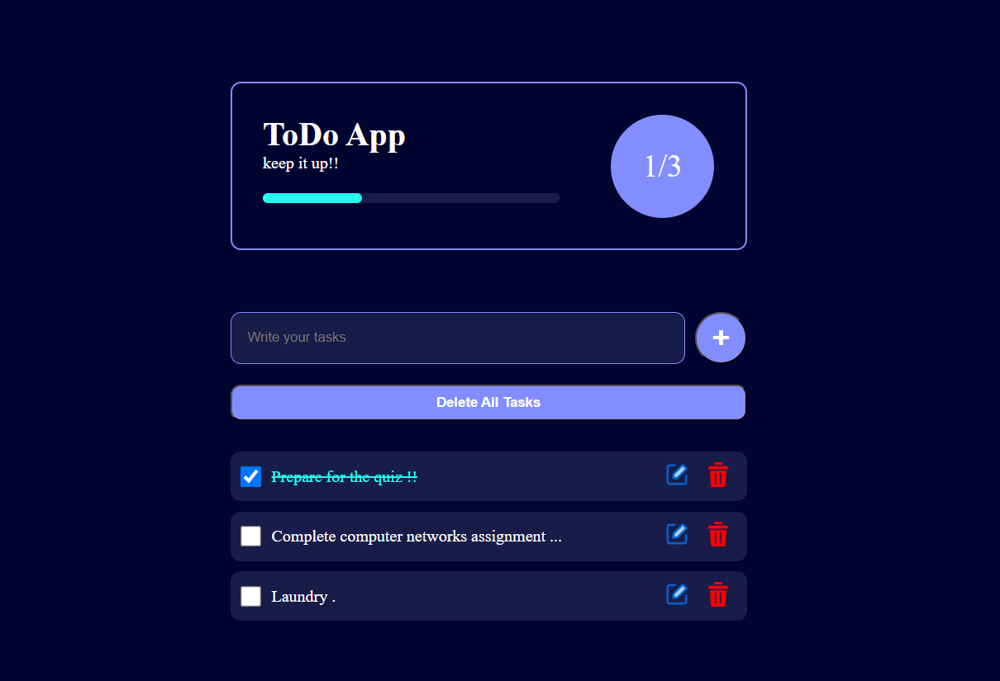

# 📝 To-Do List Web App

A simple and elegant To-Do List web application built using **HTML**, **CSS**, and **JavaScript**.  
It allows you to add, complete, edit, and delete tasks — all with real-time updates and persistent storage using **LocalStorage**.

---

## 🚀 Features

- ✅ Add new tasks
- ✅ Edit existing tasks
- ✅ Mark tasks as completed
- ✅ Delete individual tasks
- ✅ Delete all tasks at once
- ✅ Persistent tasks using `localStorage`
- ✅ Progress bar showing completion ratio
- ✅ Responsive and user-friendly interface

---

## 🖼️ Screenshots

---
